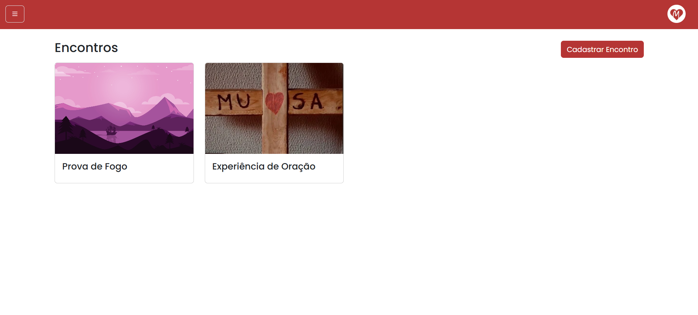
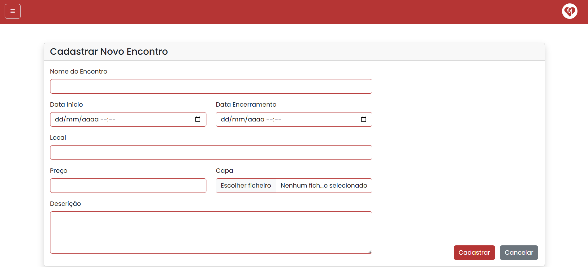
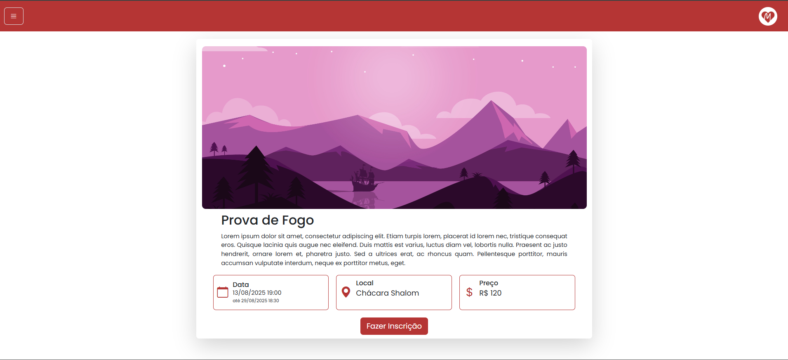

# Paróquia Nossa Senhora de Lourdes

## Site da Paróquia Nossa Senhora de Lourdes

**Versão:** 1.0

# Especificação de Caso de Uso: Gerenciar Encontro

**Data:** 17/05/2025

---

## Histórico da Revisão

| Data | Versão | Descrição | Autor |
|------|--------|-----------|--------|
| 17/05/2025 | 1.0 | Primeira Versão do Documento | Gustavo Martins dos Reis |

---

## Índice

## Índice

1. [Breve Descrição](#breve-descrição)  
2. [Fluxo Básico de Eventos](#fluxo-básico-de-eventos)  
3. [Fluxos Alternativos](#fluxos-alternativos)
   - [S1 Criação ou atualização com dados obrigatórios ausentes](#s1-criação-ou-atualização-com-dados-obrigatórios-ausentes)  
   - [S2 Exclusão de encontro com inscrições cadastradas](#s2-exclusão-de-encontro-com-inscrições-cadastradas)  
   - [S3 Verificar disponibilidade de data e local](#s3-verificar-disponibilidade-de-data-e-local)   
4. [Subfluxos](#subfluxos)   
5. [Cenários Chave](#cenários-chave)  
6. [Condições Prévias](#condições-prévias)  
   - [Login](#login)  
7. [Condições Posteriores](#condições-posteriores)  
   - [Novos Encontros Cadastrados](#novos-encontros-cadastrados)  
   - [Encontros Alterados ou Excluídos](#encontros-alterados-ou-excluídos)  
   - [Exceções](#exceções)  
8. [Pontos de Extensão](#pontos-de-extensão)  
9. [Requisitos Especiais](#requisitos-especiais)  
10. [Informações Adicionais](#informações-adicionais)  
    - [Visualização de Encontros](#visualização-de-encontros)  
    - [Cadastro de Encontros](#cadastro-de-encontros)  
    - [Edição de Encontros](#edição-de-encontros)  
    - [Caso de Uso](#diagrama-de-caso-de-uso)  
11. [Confidencialidade](#confidencialidade)

  

---

# Breve Descrição

Este caso de uso permite ao coordenador realizar o gerenciamento completo dos encontros promovidos pela comunidade. Isso inclui o cadastro de novos encontros, atualização de informações como data, horário, local e status, além da exclusão de encontros quando necessário. O objetivo é garantir que a agenda de eventos esteja sempre organizada e acessível.

Todos os usuários do sistema — participantes, servos, responsáveis e demais interessados — têm acesso à visualização dos encontros cadastrados, mesmo que não possuam permissão para editá-los, garantindo transparência e ampla divulgação das atividades.

---

# Fluxo Básico de Eventos
O fluxo básico descreve o caminho principal e ideal que o sistema deve seguir para que o caso de uso seja executado com sucesso, sem erros ou desvios. Ele representa o comportamento padrão esperado pelos usuários.

- **Início:** O usuário acessa a página de encontros do sistema, por meio da aba "Encontros".
- **Visualizar Encontros:** O sistema exibe todos os encontros futuros que estão agendados. Além disso, caso o usuário selecione um dos eventos exibidos, o sistema exibe informações detalhadas do evento.
- **Cadastrar Encontro:** Ao acessar a página com a lista de encontros e selecionar a opção "Cadastrar Novo", o coordenador pode inserir as informações solicitadas para finalizar o cadastro.
- **Editar Encontro:** No momento em que o coordenador acessar a tela de um encontro específico, ele pode acessar a funcionalidade de edição do encontro, alterando as informações desejadas e salvando as alterações.
- **Excluir Encontro:** Na tela de listagem de encontros, o coordenador pode também excluir um encontro cadastrado selecionando o ícone de exclusão.

---

# Fluxos Alternativos

Fluxos alternativos são variações do fluxo principal que descrevem situações excepcionais ou escolhas diferentes do usuário, permitindo representar caminhos alternativos que o sistema pode seguir.

### S1 Criação ou atualização com dados obrigatórios ausentes

Durante o processo de criação ou edição de um encontro, se o coordenador deixar de preencher um ou mais campos obrigatórios, o sistema exibirá uma mensagem de erro indicando os campos que precisam ser corrigidos. O fluxo retorna ao formulário para que o usuário complete as informações necessárias.

### S2 Exclusão de encontro com inscrições cadastradas

Se o coordenador tentar excluir um encontro que já possui inscrições vinculadas, o sistema impedirá a exclusão e apresentará uma mensagem informando que há dependências associadas ao encontro. O usuário deverá remover as inscrições ou desassociá-las antes de tentar excluir o encontro novamente.

### S3 Verificar disponibilidade de data e local

Este subfluxo tem como objetivo garantir que não haja conflitos de agendamento no momento da criação ou edição de um encontro. Ao informar a data e o local, o sistema realiza uma verificação para identificar se já existe outro encontro cadastrado com as mesmas informações. Caso haja conflito, uma mensagem de erro é exibida ao usuário, solicitando que ele escolha uma nova data ou local. Se não houver sobreposição, o fluxo principal segue normalmente com o agendamento do encontro.

---

# Subfluxos

Não se aplica.

---

# Cenários Chave

Os cenários chave do caso de uso Gerenciar Encontro envolvem as ações realizadas pelo coordenador ao acessar a aba de encontros do sistema. Ele pode visualizar encontros futuros, cadastrar novos encontros, editar informações de encontros já existentes e excluir encontros, desde que não haja inscrições vinculadas. Durante essas operações, o sistema realiza validações obrigatórias, como o preenchimento de campos e a verificação de conflitos de data e local. Ao final, os encontros podem ser adicionados, modificados ou removidos conforme a ação executada.

---

# Condições Prévias

Condições prévias indicam o que deve estar válido antes que o caso de uso possa ser iniciado.

### Login

Para gerenciar um encontro, é necesário que o coordenador esteja logado com o perfil correto.

---

# Condições Posteriores

Condições posteriores indicam o que deve ser verdadeiro após a conclusão do caso de uso.

### Novos Encontros Cadastrados

Após a conclusão do caso de uso, novos encontros podem ter sido cadastrados.

### Encontros Alterados ou Excluídos

Após a conclusão do caso de uso, encontros já cadatrados podem ter sido editados ou até mesmo excluídos da aplicação.

### Exceções

Durante a criação ou edição de um encontro, o usuário pode receber erros causados pela inclusão indevida de informações, seja pela ausência de dados em campos obrigatórios ou pela concorrência de data e local dos eventos, caso haja eventos com um mesmo local ou data, o usuário será informado. Além disso, durante a exclusão de um evento, o usuário também será informado caso haja inscrições cadastradas nesse encontro.

---

# Pontos de Extensão

Não se aplica.

---

# Requisitos Especiais

Não se aplica.

---

# Informações Adicionais

Nesta seção constam as informações adicionais do caso de uso.

### Visualização de Encontros
A figura 1 apresenta a tela onde são exibidos os encontros que já estão cadastrados. Além disso, a tela permite o acionamento da exclusão do encontro.

### Cadastro de Encontros
A figura 2 apresenta a funcionalidade de criação de um novo Encontro.

### Edição de Encontros
A figura 3 apresenta a tela de visualização detallhada de um encontro, nesta tela o coordenador pode acessar a opção que o conduz a edição do evento.

### Diagrama de Caso de Uso
A figura 4 apresenta o diagrama de caso de uso do sistema, indicando todas as funcionalidades presentes no sistema, incluindo o caso de uso de Gerenciar Encontro

---

# Confidencialidade

© Paróquia Nossa Senhora de Lourdes, 2025