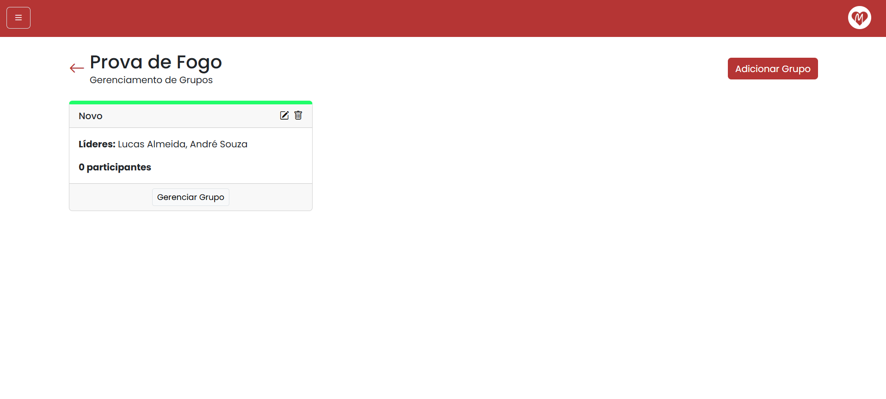
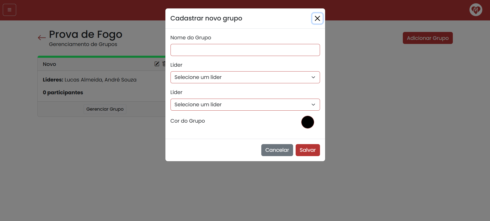

# Paróquia Nossa Senhora de Lourdes

## Site da Paróquia Nossa Senhora de Lourdes

**Versão:** 1.0

# Especificação de Caso de Uso: Gerenciar Grupos

**Data:** 07/09/2025

---

## Histórico da Revisão

| Data | Versão | Descrição | Autor |
|------|--------|-----------|--------|
| 18/08/2025 | 1.0 | Primeira Versão do Documento | Gustavo Martins dos Reis |

---

## Índice  

1. [Breve Descrição](#breve-descrição)  
2. [Fluxo Básico de Eventos](#fluxo-básico-de-eventos)  
3. [Fluxos Alternativos](#fluxos-alternativos)  
   - [S1 Preenchimento do formulário com dados ausentes](#s1-preenchimento-do-formulário-com-dados-ausentes)  
   - [S2 Líder ou Participante já em um grupo](#s2-líder-ou-participante-já-em-um-grupo)  
4. [Subfluxos](#subfluxos)  
5. [Cenários Chave](#cenários-chave)  
6. [Condições Prévias](#condições-prévias)  
   - [Coordenador ativo](#coordenador-ativo)  
7. [Condições Posteriores](#condições-posteriores)  
   - [Novos Grupos](#novos-grupos)  
   - [Grupos atualizados ou excluídos](#grupos-atualizados-ou-excluídos)  
8. [Pontos de Extensão](#pontos-de-extensão)  
9. [Requisitos Especiais](#requisitos-especiais)  
10. [Informações Adicionais](#informações-adicionais)  
    - [Visualização dos Grupos](#visualização-dos-grupos)  
    - [_Modal_ de Criação](#modal-de-criação)  
    - [Diagrama de Caso de Uso](#diagrama-de-caso-de-uso)  
11. [Confidencialidade](#confidencialidade)  

---

# Breve Descrição

Este caso de uso permite aos coordenadores, a manipulação de grupos para cada um dos encontros cadastrados no sistema. Por meio desse caso de uso, é possível cadastrar grupos, definir líderes, organizar os participantes de acordo com as inscrições já realizadas.

---

# Fluxo Básico de Eventos
O fluxo básico descreve o caminho principal e ideal que o sistema deve seguir para que o caso de uso seja executado com sucesso, sem erros ou desvios. Ele representa o comportamento padrão esperado pelos usuários.

- **Início:** O usuário acessa a página de um encontro e selciona a opção "Grupos" que o direciona para a parte de gerenciamento de grupos do evento.
- **Visualização dos Grupos:** Ao acessar essa página, já será possível visualizar os grupos já cadastrados. Inicialmente, é exibido o nome do grupos, seus líderes e a quantidade de participantes, além da opção de "Gerenciar Participantes". Caso não haja grupos cadastrados para aquele encontro, é exibida uma mensagem indicando a ausência de grupos juntamente com um botão para o cadastro.
- **Cadastro de Grupo:** Ao selecionar a opção de cadastrar um novo grupo, um _modal_ é aberto com um formulário. Nesse formulário, o coordenador deve preencher o nome do grupo, os dois líderes e a cor do grupo. Todos os campos são obrigatórios para o preenchimento.
- **Gerenciamento dos Participantes:** Ao selecionar a opção de gerenciamento de participantes, um novo _modal_ é aberto mostrando os participantes que estão naquele grupo. Além disso, o modal permite a busca e adição dos participantes que já realizaram a inscrição no encontro.
- **Editar Grupo:** Ao selecionar o ícone de edição na página de visualização dos grupos, será possível editar as informações que foram preenchidas na criação.
- **Excluir Grupo:** Ao selecionar o ícone de exclusão na página de visualização dos grupos, será possível excluir o grupo, removendo todos os participantes que estavam cadastrados nele.

---

# Fluxos Alternativos 

Fluxos alternativos são variações do fluxo principal que descrevem situações excepcionais ou escolhas diferentes do usuário, permitindo representar caminhos alternativos que o sistema pode seguir.

### S1 Preenchimento do formulário com dados ausentes

Durante o processo de preenchimento das informações, caso o usuário tente enviar as informações sem ter preenchido algum campo obrigatório, o sistema informa que aquelas informações devem ser inseridas.

### S2 Líder ou Participante já em um grupo

Não será possível definir um líder ou um participante em mais de um grupo do mesmo encontro. Nesse cenários, essas pessoas não serão opções para o usuário.

---

# Subfluxos

Não se aplica.

---

# Cenários Chave

Os cenários chave do caso de uso Realizar Inscrição envolvem as ações realizadas pelo coordenador ao acessar a página de gerenciamento de grupos. Para isso, o coordenador seleciona o encontro desejado e acessa a opção "Grupos". A partir disso, o usuário poderá visualizar os grupos já criados, além de criar novos, editar ou exluir e gerenciar os participantes em cada um dos grupos..

---

# Condições Prévias

Condições prévias indicam o que deve estar válido antes que o caso de uso possa ser iniciado.

### Coordenador ativo

É necessário que o coordenador tenha acessado o sistema com o seu CPF e senha.

---

# Condições Posteriores

Condições posteriores indicam o que deve ser verdadeiro após a conclusão do caso de uso.

### Novos Grupos

Após a conclusão do caso de uso, novos grupos são cadastrados.

### Grupos atualizados ou excluídos

Após a conclusão do caso de uso, grupos já existentes podem ser editados ou excluídos.

---

# Pontos de Extensão

Não se aplica.

---

# Requisitos Especiais

Não se aplica.

---

# Informações Adicionais

Nesta seção constam as informações adicionais do caso de uso.

### Visualização dos Grupos
A figura 1 apresenta a tela com a visualização dos grupos do encontro.

### _Modal_ de Criação
A figura 2 apresenta o _modal_ para criação de um novo grupo.

### Diagrama de Caso de Uso
A figura 3 apresenta o diagrama de caso de uso do sistema, indicando todas as funcionalidades presentes no sistema, incluindo o caso de uso de Gerenciar Encontro

---

# Confidencialidade

© Paróquia Nossa Senhora de Lourdes, 2025