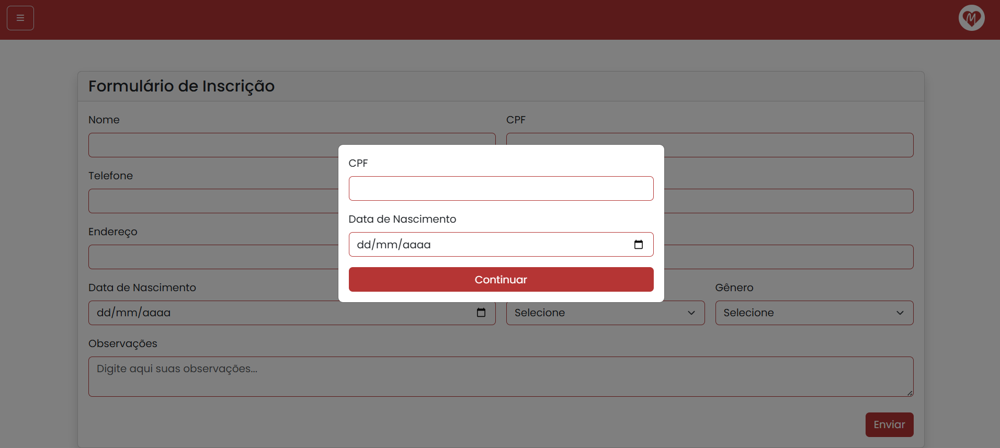
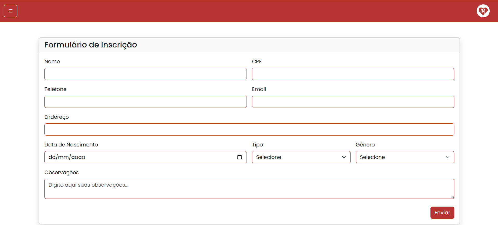

# Paróquia Nossa Senhora de Lourdes

## Site da Paróquia Nossa Senhora de Lourdes

**Versão:** 1.0

# Especificação de Caso de Uso: Realizar Inscrição

**Data:** 17/05/2025

---

## Histórico da Revisão

| Data | Versão | Descrição | Autor |
|------|--------|-----------|--------|
| 18/08/2025 | 1.0 | Primeira Versão do Documento | Gustavo Martins dos Reis |

---

## Índice

1. [Breve Descrição](#breve-descrição)  
2. [Fluxo Básico de Eventos](#fluxo-básico-de-eventos)  
3. [Fluxos Alternativos](#fluxos-alternativos)
   - [S1 Preenchimento do formulário com dados ausentes](#s1-preenchimento-do-formulário-com-dados-ausentes)  
   - [S2 Participante já inscrito no encontro](#s2-participante-já-inscrito-no-encontro) 
4. [Subfluxos](#subfluxos)   
5. [Cenários Chave](#cenários-chave)  
6. [Condições Prévias](#condições-prévias)  
   - [Encontro aberto](#encontro-aberto)  
7. [Condições Posteriores](#condições-posteriores)  
   - [Novas Inscrições](#novas-inscrições)  
   - [Dados de pessoa cadastrados ou atualizados](#dados-de-pessoa-cadastrados-ou-atualizados)  
   - [Exceções](#exceções)  
8. [Pontos de Extensão](#pontos-de-extensão)  
9. [Requisitos Especiais](#requisitos-especiais)  
10. [Informações Adicionais](#informações-adicionais)  
    - [Modal de Verificação](#modal-de-verificação)  
    - [Formulário de Inscrição](#formulário-de-inscrição)  
    - [Caso de Uso](#diagrama-de-caso-de-uso)  
11. [Confidencialidade](#confidencialidade)

---

# Breve Descrição

Este caso de uso permite aos participantes a realização da inscrição para um determinado encontro. O processo recebe as informações do participante, incluindo as informações do responsável, quando necessário.

---

# Fluxo Básico de Eventos
O fluxo básico descreve o caminho principal e ideal que o sistema deve seguir para que o caso de uso seja executado com sucesso, sem erros ou desvios. Ele representa o comportamento padrão esperado pelos usuários.

- **Início:** O usuário acessa a página de inscrição em um evento selecionando a opção "Realizar Inscrição" na tela do encontro.
- **Verificação Inicial:** O sistema exibe um _modal_ que solicita o CPF e a data de nascimento com o objetivo de verificar se as informações do participante que será inscrito já estão cadastradas no sistema. Caso a pessoa já esteja inscrita, as informações são buscadas no banco de dados e todos os campos são preenchidos automaticamente, mas ainda assim permitindo alterações. Caso a pessoa não esteja inscrita, somente os campos de CPF e data de nascimento são preenchidos.
- **Preenchimento das Informações:** Após acessar o formulário, todas as informações do participante devem ser preenchidas, incluindo nome, CPF, telefone, data, email, endereço, data de nascimento, tipo (servo ou participante), sexo, observações, e ministério caso seja um servo. Além disso, o usuário seleciona também, por qual meio de contato ele deseja receber os dados de pagamento.
- **Preenchimento das Informações do Responsável:** Caso a data de nascimento preenchida indique que o participante seja menor de idade, os campos do responsável são exibidos para o preenchiemtno obrigatório, incluindo nome, CPF e telefone.
- **Enviar Informações:** Após preencher todos os campos, o usuário acionar o botão de "Enviar", as informações são validadas, caso a pessoa já esteja cadastrada, as informações são atualizadas. Posteriormente, uma mensagem de sucesso é exibida, informando que os dados de pagamento foram enviados pela forma de contato selecionada.
- **Dados do Pagamento** As informações do pagamento são enviadas para o participante por meio de uma API por e-mail ou Whatsapp, de acordo com a escolha do participante.

---

# Fluxos Alternativos 

Fluxos alternativos são variações do fluxo principal que descrevem situações excepcionais ou escolhas diferentes do usuário, permitindo representar caminhos alternativos que o sistema pode seguir.

### S1 Preenchimento do formulário com dados ausentes

Durante o processo de preenchimento das informações, caso o usuário tente enviar as informações sem ter preenchido algum campo obrigatório, o sistema informa que aquela(s) informações devem ser inseridas.

### S2 Participante já inscrito no encontro

Caso o participante tente realizar a inscrição mesmo já esteja inscrito no encontro, uma mensagem de erro é exibida: "Erro ao realizar inscrição: O CPF 'CPF' já está inscrito nesse encontro."

---

# Subfluxos

Não se aplica.

---

# Cenários Chave

Os cenários chave do caso de uso Realizar Inscrição envolvem as ações realizadas pelo participante (ou responsável) ao acessar a página de inscrição de um encontro no sistema. Ele pode selecionar o encontro desejado, preencher ou atualizar suas informações pessoais e, quando aplicável, informar os dados de um responsável. Durante o processo, o sistema realiza validações obrigatórias, como a verificação da idade mínima e a consistência dos dados informados. Ao final, a inscrição é registrada e o sistema envia as informações de confirmação e de pagamento por meio da forma de contato escolhida pelo usuário.

---

# Condições Prévias

Condições prévias indicam o que deve estar válido antes que o caso de uso possa ser iniciado.

### Encontro aberto

O encontro desejado deve estar aberto para inscrições.

---

# Condições Posteriores

Condições posteriores indicam o que deve ser verdadeiro após a conclusão do caso de uso.

### Novas Inscrições

Após a conclusão do caso de uso, novas inscrições são cadastradas.

### Dados de pessoa cadastrados ou atualizados

Após a conclusão do caso de uso, novos cadastros de pessoa podem ser realizados ou atualizados.

### Exceções

Durante a realização da inscrição, o sistema valida se todos os dados obrigatórios foram informados, como nome, CPF e data de nascimento. Caso alguma dessas informações esteja ausente, a inscrição não será concluída e o usuário será informado sobre a necessidade de preencher os campos faltantes. Além disso, o sistema verifica se o CPF informado já está vinculado a uma inscrição para o mesmo encontro, impedindo duplicidades e notificando o usuário caso essa situação ocorra.

---

# Pontos de Extensão

Não se aplica.

---

# Requisitos Especiais

Não se aplica.

---

# Informações Adicionais

Nesta seção constam as informações adicionais do caso de uso.

### Modal de Verificação
A figura 1 apresenta a tela com o _modal_ que verifica se a pessoa já está cadastrada no sistema.

### Formulário de Inscrição
A figura 2 apresenta o formulário que recebe as informações do participante.

### Diagrama de Caso de Uso
A figura 3 apresenta o diagrama de caso de uso do sistema, indicando todas as funcionalidades presentes no sistema, incluindo o caso de uso de Gerenciar Encontro

---

# Confidencialidade

© Paróquia Nossa Senhora de Lourdes, 2025